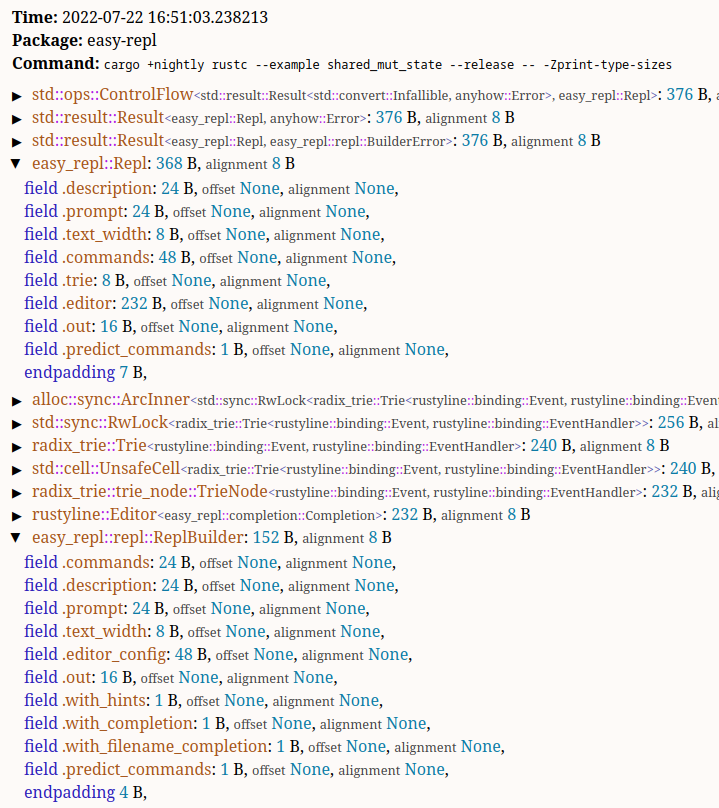

# rust-type-sizes

A script to analyze type sizes used in a Rust program.
It first compiles the code with `cargo +nightly rustc <args> -- -Zprint-type-sizes`
(requires nightly toolchain) and then generates a HTML report.
The report is organized into collapsible tree of types/fields/variants
with information about their size, alignment and offset (fields).

## Usage

Make sure to download nightly version of the toolchain used in the project,
e.g. when building for host on linux:

```sh
rustup target add x86_64-unknown-linux-gnu --toolchain nightly
```

e.g. if cross-compiling for arm-unknown-linux-gnueabihf:

```sh
rustup target add arm-unknown-linux-gnueabihf --toolchain nightly
```

Then enter Rust project directory and run:

```sh
python path/to/type-sizes.py --sort-size --bin your_binary_name --release
```

Then open the file `./type-sizes/index.html` in web browser.

Use `python path/to/type-sizes.py` to see available options.
All unlisted arguments are passed to `cargo +nightly rustc <args> -- -Zprint-type-sizes`.

## Example output


